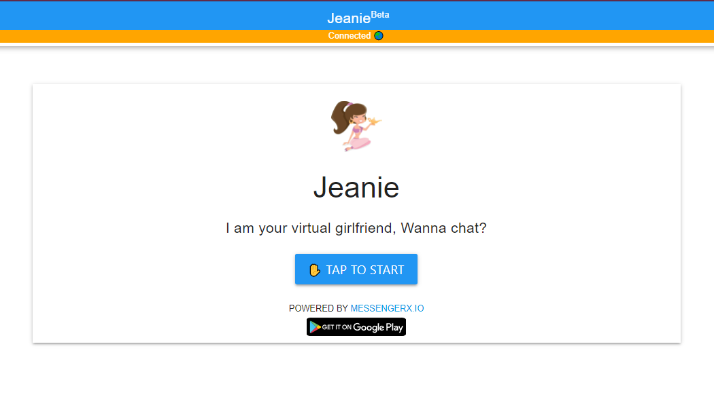

## A GPT-J Powered AI Character Girlfriend Chatbot Template ##
The intent of this template is to serve as a quick intro guide for fellow developers 
looking to build AI Powered Personalized Characters

## Live Web Demo ##


[Jeanie](https://messengerx.io/jeanie) is a GPT-J powered virtual girlfriend based on this repository

## Requirements for running it locally on laptop ##
* Windows / Mac / Linux with Git installed
* Python 3.5+
* MessengerX.io API Token - FREE for Indie Developers
* Ngrok for Tunneling
* Desktop / Laptop with a minimum of 16GB RAM 
* GPU is required for faster inference
* EleutherAI/gpt-neo-1.3B (Be patient, first load and / or first time inference can take time)
* NLPCloud.io Token - (Optional)

  
## Local Setup ##
### Download or clone this repository ###
```
git clone git@github.com:machaao/gpt-j-chatbot.git

cd gpt-j-chatbot
```


### Install requirements ###
```bash
pip install -r requirements.txt
```

### Create a new .env file in the gpt-j-chatbot directory ###
```bash
nano -w .env
```

```
API_TOKEN = <Machaao API Token>
BASE_URL = <Machaao Base Url> ex: https://ganglia.machaao.com
NAME = <Your Bot Display Name> ex: Jess
DASHBOT_KEY = <Your dashbot token> (Optional) (Conversational Analytics)
MODEL_NAME=EleutherAI/gpt-neo-1.3B # for local inference / testing [we recommend using GPT-NEO 1.3B for 16GB ram - load can take up to 1 min and inference avg is about 10 - 20 seconds] See https://huggingface.co/EleutherAI for additional models
NLP_CLOUD_TOKEN = <NLP Cloud Token>  # for faster remote inference


# BOT PARAMS - Unset Parameters would use their default values.
# Don't use Top_p and Temperature parameters simultaneously.
# Default Values are mentioned below.
# The higher this value, the less deterministic the result will be
TOP_P="1.0" 
# The higher this value, the less deterministic the result will be
TEMPERATURE="0.8"
# The lower this value, the less likely GPT-J is going to generate off-topic text
TOP_K="50"
# The maximum number of tokens that the generated text should contain
MAX_LENGTH="50"
```
For better understanding of the above GPT-J parameters, check out the [nlpcloud.io](https://docs.nlpcloud.io/#generation) docs


## Get MessengerX.io API Key ##
* Get your FREE Developer API Token via [MessengerX.io](https://portal.messengerx.io), replace it in the ```.env``` file under the entry ```API_TOKEN```
* MessengerX.io allows you to build and integrate a custom chatbot in your website or app


## Get NLPCloud.io API Key (Recommended for Production) ##
* You can acquire an NLPCloud API Key via [NLP Cloud](https://nlpcloud.io) and replace it in the ```.env``` file under the entry
```NLP_CLOUD_TOKEN```
  
## Get Dashbot.io API KEY (Recommended for Production) ##
* You can acquire the API Key via [Dashbot.io](https://dashbot.io) and replace it in the ```.env``` file under the entry
```DASHBOT_KEY```

### Modify logic/prompt.txt to change the character script ###
```
bot_name is a very understanding girl
bot_name and stranger are seeing each other
Here is a recent discussion between stranger and bot_name
###
stranger: hi
bot_name: hello there
```

### Modify the core() function in logic/bot_logic.py to personalize responses ###
```
def core(self, req: str, user_id: str):
```
* Refer to [platform documentation](https://messengerx.rtfd.iio) for personalization options

### Run the chatbot server from the root directory of the repo ###
```
python app.py
```

### Start ngrok.io tunnel ###
```
ngrok http 5000
```

### Update your webhook ###
Update your bot Webhook URL at [MessengerX.io Portal](https://portal.messengerx.io) with the url provided as shown below to continue development
```
If you use [Ngrok.io](https://ngrok.io), your webhook URL would be of the format as in the example below
https://1234-115-187-40-104.ngrok.io/machaao/hook
```


### Test your bot:
Visit: ```https://messengerx.io/<bot-name>```

## Remote Setup (Heroku) ##

We are assuming you have access to a [heroku account](https://heroku.com)
and have installed heroku command line client for your OS.

### Login to Heroku ###
```
heroku login
```

### Create a new app on Heroku and note down your heroku app name
```
heroku create
```

### Commit changes and push the repository to Heroku ###
```
git commit -m ".env updated"
git push heroku master
```

### Open the logs to confirm successful Deployment ###
```
heroku logs --tail
```

### Update your webhook ###
Update your bot Webhook URL at [MessengerX.io Portal](https://portal.messengerx.io) with the heroku app url
```
Webhook Url: <YOUR-HEROKU-APP-URL>/machaao/hook
```

### Test your bot:
Visit: ```https://messengerx.io/<your-character-name>```

### Known Issues (on M1+ Macs)
```
Tips for MPS on Mac [Use Nightly Build]
pip3 install --pre torch torchvision torchaudio --index-url https://download.pytorch.org/whl/nightly/cpu
```

- Running on MPS is unstable
- Running on CPU is reliable but slower
- Approx inference time > 60 seconds on Mac M1 Pro 2021 / 16GB (GPT-Neo)


## Notes / Additional Resources ##
* Please note that this document isn't meant to be used as a guide for production environment setup.
* Reach out to us on [Twitter](https://twitter.com/messengerxio) for any queries
